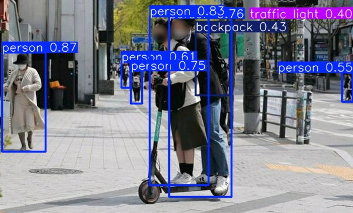
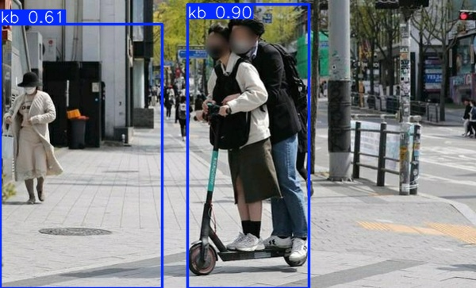
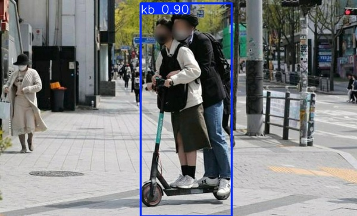

# 💡 여름방학 해성여자고등학교 캡스톤 탐구 프로젝트

---

## 📌 프로젝트 개요

- **프로젝트 기간**: 2025년 7월 22일 ~ 2025년 7월 25일  
- **프로젝트 목표**: 인공지능을 이용한 학교 앞 이동 대수 확인

## 각 파일 설명

- ex1_2.py : 동영상을 읽어서 이미지로 만드는 파일
- kb_yolo_syb.pt : 킥보드를 인식하는 학습된 YOLO모델
- video_read.py : 학교 앞을 찍은 동영상에서 지나가는 차량 대수를 세는 코드

## 객체 탐지 해결책 제시 이유
- 학교 앞 도로를 지나가는 차량 대수는 사람이 바로 파악하기 힘들 정도로 불규칙적이며 오랜시간동안 반복해서 관찰하고 기록해야 한다.

- 이런 의미에서 인공지능인 객체 탐지 모델을 사용하여 지나간 차량의 대수를 알아내는 것은 효율적인 방법이며, 객체 탐지 분야의 빠른 발전 속도를 생각해볼 때 자동화하기 쉽고, 매우 정확한 결과를 기대할 수 있다.

- 객체 탐지 모델의 학습에는 학습 데이터의 양이 매우 중요한 요소인데 차량 데이터는 직접 구하기도 쉬웠고, 특히 차량 한 대도 놓치지 않을 정도로 성능 높은 모델이 많다.

## 학습된 결과

## 결과 토의
- 실제 7일 ( 2025년 *월 *일부터 *월 *일까지)간 등교시간 차량 이동 건수는 **건으로 오전 시간의 차량 이동 건수인 **건에 비하여 **배한다는 것을 알 수 있었습니다.

- 이를 통해, 아침 등교시간에 학교의 차량 이동 건수가 모여서 학생들이 위험하게 느낄 수 있다고 생각하는 문제가 있다는 것이 옳았다는 것을 찾는 과정을 통해 알 수 있었습니다.

- 노트북을 학교 앞에서 직접 설치하고 모델을 실행해야 해서 (충전 문제와 설치 안전 문제로 인해) 더 많은 시간을 끌 수 없다는 것은 아쉬웠습니다. 더 많은 시간을 분석할 수 있다면 더 분리할 수 있도록 도와주는 힘을 결합할 수 있다고 생각합니다.

실제로 학교에서 세션이 실생활의 문제를 해결하는 방법이 있다는 것을 경험할 수 있는 것처럼 보이찬 시간이었다고 생각합니다.